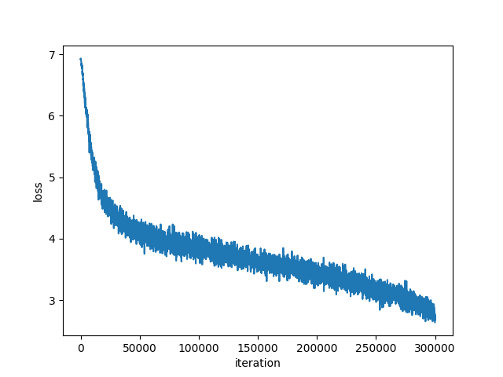
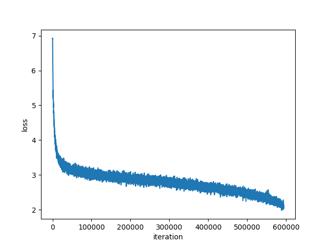

# Single Path One-Shot NAS
Here is a Pytorch based re-implementation of the paper: [Single Path One-Shot Neural Architecture Search with Uniform Sampling](https://openreview.net/pdf?id=r1gPoCEKvH), ICLR 2020 under review.

The choice block structure, data augmentation strategy, learning rate schedule, weight decay, etc. are the same with the [ShuffleNetV2+](https://github.com/megvii-model/ShuffleNet-Series). The supernet and best subnet are trained for 120 and 360 epochs respectively. Only block search is implemented and the FLOPs constraint is not added yet.

## Trained Models 
| Model |  Google Drive |
| --- | :---: |
| Supernet | [ckpt_ep119.pth.tar](https://drive.google.com/open?id=1va07sHULzdNpe0evOlqwX9vPC58sf9gX) |
| Best subnet| [ckpt_ep359.pth.tar](https://drive.google.com/open?id=18Rfn5ve6hUssHQ98vhOiViR9cadPAUf2) |

## Environments
```shell 
python == 3.7.3 pytorch == 1.2.0 cuda == 10.1
pip install apex
```

## Usage 
### Dataset Preparation
Split the original imagenet training set into two parts: 50000 images for validation (50 images for each class exactly) and the rest as the training set by running: 
```shell
python data_split.py \
--data-dir=/path/to/imagenet/training/dataset \
--train-save-path=/path/to/save/supernet/train/dataset \
--val-save-path=/path/to/save/supernet/val/dataset
```

Then all the absolute paths of the split training dataset and val dataset will be saved into csv files.

### Supernet Training
If training in distributed mode, then run:  
```shell
sh distributed_supernet_train.sh NUM_GPU \
--distributed=True \
--gpu-devices=AVAILABLE_GPU_IDS \
--total-epochs=120 \
--batch-size=BATCH_SIZE_PER_GPU \
--train-path=/path/to/supernet/train/dataset \
--val-path=/path/to/supernet/val/dataset
```

If training in data parallel mode, simply run:
```shell
python supernet_train.py \
--gpu-devices=AVAILABLE_GPU_IDS \
--total-epochs=120 \
--batch-size=TOTAL_BATCH_SIZE \
--train-path=/path/to/supernet/train/dataset \
--val-path=/path/to/supernet/val/dataset
```

### Architecture Search
If searching in distributed mode, run:
```shell
sh distributed_search.sh NUM_GPU \
--distributed=True \
--gpu-devices=AVAILABLE_GPU_IDS \
--max-iter=20 \
--topk=10 \
--mut-prob=0.1 \
--batch-size=BATCH_SIZE_PER_GPU \
--ckpt-path=/path/to/supernet/last/checkpoint \
--train-path=/path/to/supernet/train/dataset \
--val-path=/path/to/supernet/val/dataset
```

else run:
```shell
python search.py \
--gpu-devices=AVAILABLE_GPU_IDS \
--max-iter=20 \
--topk=10 \
--mut-prob=0.1 \
--batch-size=TOTAL_BATCH_SIZE \
--ckpt-path=/path/to/supernet/last/checkpoint \
--train-path=/path/to/supernet/train/dataset \
--val-path=/path/to/supernet/val/dataset
```

### Best Subnet Training
If training in distributed mode, run:
```shell
sh distributed_train.sh NUM_GPU \
--distributed=True \
--gpu-devices=AVAILABLE_GPU_IDS \
--best-arch=BEST_ARCH \
--total-epochs=360 \
--batch-size=BATCH_SIZE_PER_GPU \
--train-path=/path/to/imagenet/train/dataset \
--val-path=/path/to/imagenet/val/dataset
```

else run:
```shell
python train.py \
--gpu-devices=AVAILABLE_GPU_IDS \
--best-arch=BEST_ARCH \
--total-epochs=360 \
--batch-size=TOTAL_BATCH_SIZE \
--train-path=/path/to/imagenet/train/dataset \
--val-path=/path/to/imagenet/val/dataset
```

## Results
### Searching Results
Top-10 architectures:

| Arch | Params | FLOPs | Prec@1 |
| --- | :---: | :---: | :---: |
| [2, 2, 3, 0, 2, 0, 2, 1, 2, 2, 2, 1, 3, 1, 1, 3, 2, 0, 1, 1] | 3.8M | 339M | 62.82% |
| [2, 3, 1, 0, 2, 2, 3, 1, 2, 2, 2, 1, 3, 3, 1, 3, 2, 0, 1, 1] | 3.8M | 348M | 62.78% |
| [2, 2, 3, 0, 2, 0, 1, 1, 2, 2, 2, 1, 3, 3, 1, 0, 2, 0, 1, 1] | 3.8M | 337M | 62.74% |
| [2, 2, 3, 0, 2, 1, 1, 1, 2, 2, 2, 1, 3, 1, 1, 3, 2, 0, 1, 1] | 3.8M | 339M | 62.74% |
| [2, 2, 3, 0, 2, 0, 1, 1, 2, 2, 2, 1, 3, 1, 1, 3, 2, 0, 1, 1] | 3.8M | 338M | 62.72% |
| [2, 2, 3, 0, 2, 3, 1, 1, 2, 3, 2, 1, 3, 3, 1, 3, 2, 0, 1, 1] | 3.9M | 353M | 62.70% |
| [2, 2, 3, 0, 1, 0, 1, 2, 2, 2, 2, 1, 3, 1, 1, 0, 2, 0, 1, 1] | 3.8M | 331M | 62.69% |
| [0, 2, 1, 0, 2, 0, 1, 2, 2, 2, 2, 1, 2, 3, 1, 3, 2, 0, 1, 1] | 3.8M | 331M | 62.66% |
| [2, 2, 3, 0, 2, 0, 1, 1, 2, 2, 2, 1, 3, 1, 1, 0, 2, 0, 1, 1] | 3.8M | 332M | 62.65% |
| [2, 2, 3, 0, 2, 0, 1, 2, 2, 2, 2, 1, 3, 3, 1, 3, 2, 0, 1, 1] | 3.9M | 345M | 62.65% |

### Training Results
| Model | Params | FLOPs |  Prec@1 | Prec@5 |
| --- | :---: | :---: | :---: | :---: |
| Supernet | 10.6M | - | 61.4% | 83.6% |
| Best subnet | 3.8M | 339M | 72.7% | 91.0%
| Official | 3.3M | 319M | 74.3% | - | 

## Logs
### Supernet Training

### Best Subnet Training

